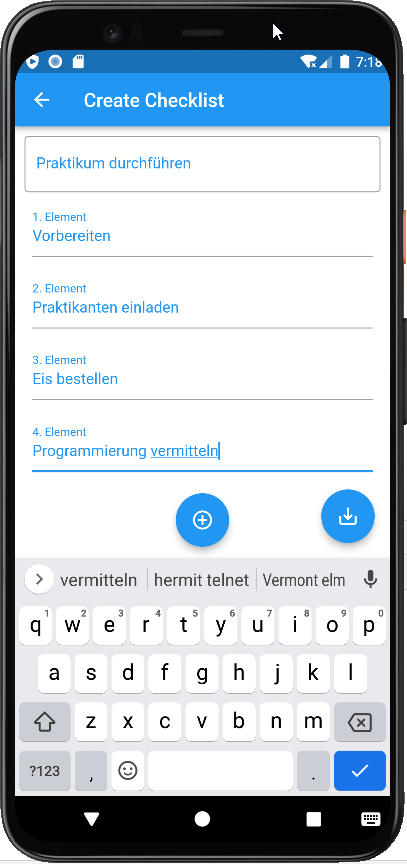
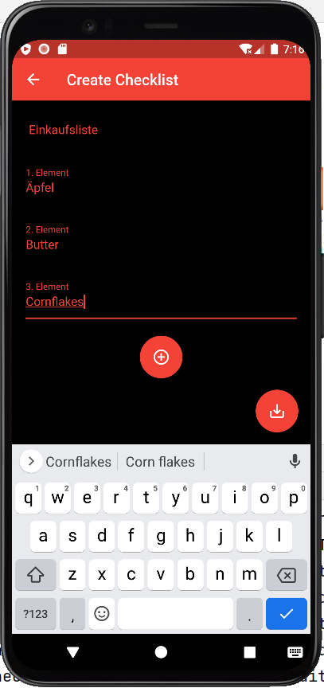
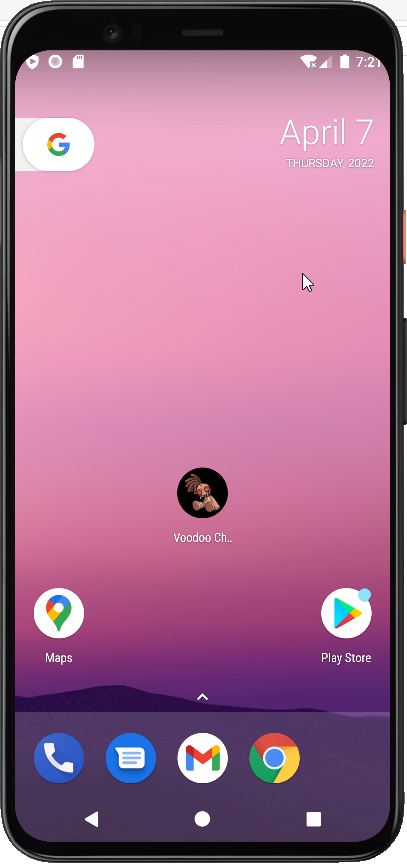
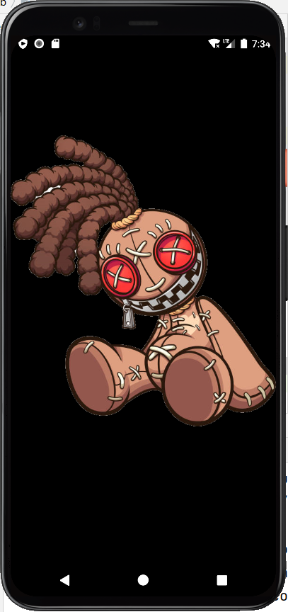
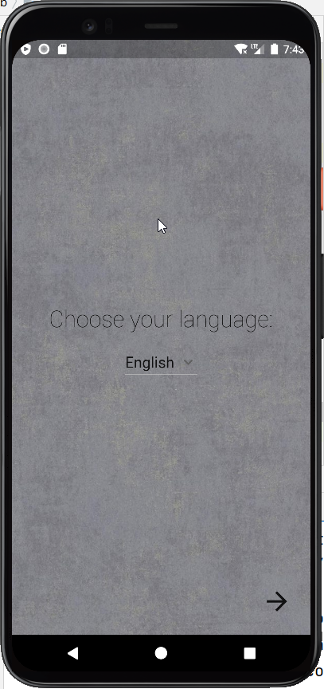
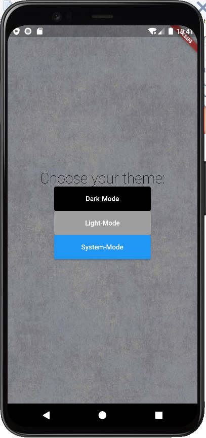
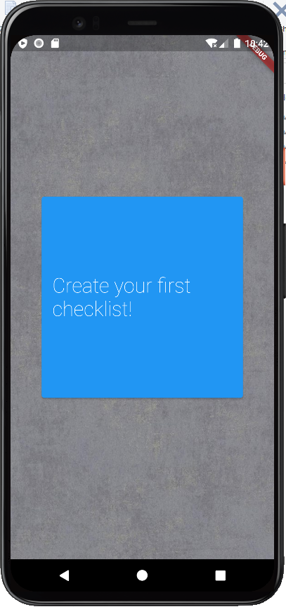
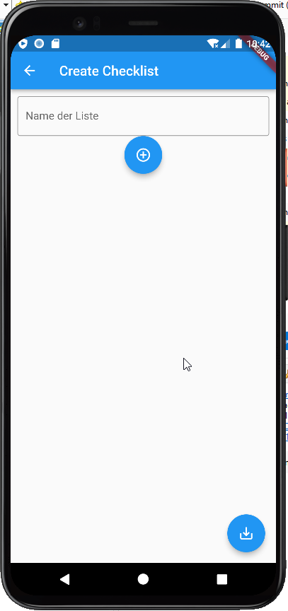
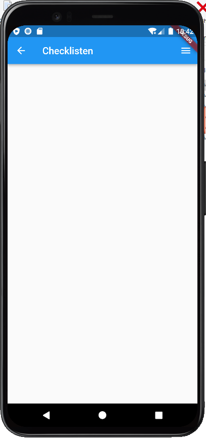

# Checklisten-App-2022.1
Checklisten erstellen und ausfüllen mit einer App für Smartphones 📱.

## Mittwoch 6.4.2022

Wir haben uns um die bisher eingetragenen Issues gekümmert und ein bisschen "echte" Funktionalität ergänzt, d.h. dass die App sich erstmals Eingaben merkt.

Die Umschaltung zwischen Themes klappt schon. Es gibt ein dunkles Theme und ein helles Theme.

Ein nicht unerheblicher Teil der Arbeit floss auch in das Icon der App, bis es rund und mit dem richtigen Hintergrund angezeigt wurde:

Die übrigen Arbeiten fanden unsichtbar im Hintergrund statt: es entstand Programmcode für das Speichern von Daten usw. Wir stellen fest, dass das Pareto-Prinzip hier greift: am ersten Tag (20% des Aufwandes) entstand ein großer Teil der Oberfläche (80%). Möglicherweise verbringen wir das restliche BOGY (80%) ohne größere sichtbare Änderungen.

## Dienstag 5.4.2022

Wir haben uns auf einen Namen für unsere App geeinigt: Voodoo-List.

Unsere Prioritäten für die Umsetzung:

* Icon und Name
* übersichtliches Menü (neutraler Hintergrund)
* Checklisten-Name (eintippen)
* Dark Mode
* Checklisten-Editor, evtl. mit tabellarischer Darstellung
* mehrere Checklisten erstellen und verwalten
* Fortschrittsanzeige 
* Wiederholung einer Checkliste in einem bestimmten Intervall (täglich / wöchentlich)
* Kalender: diese Checkliste brauche ich an diesem Tag / spezialisierter Kalender, Checkliste für einen Tag (Termine; Hausaufgaben)
* Erinnerung an eine Checkliste oder einzelne Einträge davon
* Checklisten miteinander verbinden (Checkliste in Checkliste; Ober-Checkliste mit Unter-Checklisten)
* Übersetzung in mehrere Sprachen
* Warnsystem für nicht ausgefüllte Checklisten
* Hilfe-Funktion / Tutorial oder Einführung
* Pro-Version: unbegrenzte Anzahl Listen und  Einträge
  * Checkliste mit jemandem teilen / Checkliste an jemanden senden
  * Handschrifterkennung
  * Bilder an einen Checklisten-Eintrag anhängen
* Gratisversion: nur eine Liste o.ä.
* Werbung einblenden (könnte Beliebtheit reduzieren)
* Geo-Fencing: Checkliste an einem bestimmten Ort aufrufen
* Belohnungssystem / Prokrastinations-Modus
* Sollte flott sein (reagiert in kurzer Zeit)
* für mehrere Geräte (Smartphone, Tablet, Watch), Android und iOS
  * Flutter macht das schon

Wir haben folgende Seiten in unserer App designt:

Splashscreen für unsere Voodoo-App:

Sprachauswahl:

Theme-Auswahl:

Erstellen der ersten Checkliste:

Editieren einer Checkliste:

Ansicht der verfügbaren Checklisten:

## Montag, 4.4.2022

Wir haben uns die Gestaltung von Android Apps mit Hilfe von [Flutter (PPTX⇓)](Flutter.pptx) angeschaut ein ein paar Beispiel-Oberflächen inklusive Navigation entwickelt. Wir haben uns auch noch ein wenig mit [Gestalt Principles (Wikipedia)](https://de.wikipedia.org/wiki/Gestaltpsychologie) beschäftigt und ein paar Beispiele besprochen:

* Proximity (Gruppierung über Nähe bzw. Abstand)
* Similarity (Ähnlichkeit, z.B. Farbe oder Form)
* Continuity (Zusammenhang)

## Mittwoch 30.3.2022

Wir haben den Nachmittag begonnen mit der Kata (Programmierübung) ["Is it a palindrome" bei Codewars](https://www.codewars.com/kata/57a1fd2ce298a731b20006a4).

Im Anschluss sind wir die letzten Folien der [Dart (PPTX⇓)](Dart.pptx) Präsentation durchgegangen und haben die Objektorientierung behandelt. Damit haben wir die Programmiersprache ziemlich vollständig durchdrungen und können uns in der BOGY-Woche direkt mit der Programmierung einer Oberfläche beschäftigen.

## Mittwoch 23.3.2022

Weiter ging es mit der Programmiersprache [Dart (PPTX⇓)](Dart.pptx). Die Konzepte aus diesem Nachmittag brauchen wir für die Flutter Programmierung:

* Named Arguments
* Scope
* Callbacks
* Lambdas
* Async / Await

Wir haben uns bis Folie 79 durchgearbeitet.

Hausaufgaben (freiwillig):

* Programmier-Aufgaben bei [Codewars](https://www.codewars.com) lösen

## Mittwoch 16.3.2022

Wir haben die Lösung der Aufgabe von letztem Mal besprochen und dabei Funktionen des Debuggers kennengelernt (Breakpoints, Variableninspektion, ...). Danach haben wir uns die Programmiersprache [Dart (PPTX⇓)](Dart.pptx) weiter zu Gemüte geführt und die Kapitel 

* Listen
* Maps (Dictionaries)
* Methoden
* Funktionen

bearbeitet. Die Aufgaben auf Folie 51 und 52 haben wir noch gelöst.

Aufgabe: Programmiere eine Funktion, die das gleiche Ergebnis liefert wie math.pow()

* [Lösung](https://dartpad.dev/?id=acf8e4c4c1a098d7fd1fa34011174558)

Aufgabe: Schreibe eine Funktion, die aus einer Liste mit Zahlen die kleinste heraussucht.

* [Lösung](https://dartpad.dev/?id=f031adea08afe8c848cc6cc9a885c9a0)

## Mittwoch 9.3.2022

Wir haben uns weiter mit der Programmiersprache [Dart (PPTX⇓)](Dart.pptx) beschäftigt und dort die Kapitel

* Strings
* Wiederholungen
* Wahrheitswerte
* Verzweigungen

durchgearbeitet. Wir sind bis Folie 37 gekommen.

Für ein paar Aufgaben stellen wir Euch eine mögliche Lösung auf DartPad vor:

- [Lösung Übung 1](https://dartpad.dev/?id=bc2ccef0f3caaa3444577838340cb746&null_safety=true): Berechne 356*4³
- [Lösung Übung 2](https://dartpad.dev/?id=600212c3180ea97c91c25899fe08fe32&null_safety=true): 36² -> WXYZ -> XY -> XY²
- Aufgabe 3: Wie viele Zahlen zwischen 100 und 999 enthalten die Ziffer 3?
  - [textuelle Lösung mit `.substring()`](https://dartpad.dev/?id=e7cf8b4b3136d8e34531d672d342a65d&null_safety=true)
  - [textuelle Lösung mit `.contains()`](https://dartpad.dev/?id=275d13381ca893879be2b6f6b82559e2&null_safety=true)
  - [mathematischer Ansatz explizit für jede Stelle einzeln](https://dartpad.dev/?id=e3d80e324549714017110f64f301fcef&null_safety=true)
  - [mathematischer Ansatz von hinten her](https://dartpad.dev/?id=f2be1413b7d7b839a8ce1e1df04ea7dd&null_safety=true)
  - [mathematischer Ansatz von vorne her](https://dartpad.dev/?id=79ece0ba0264cb39c437984a0b63202b&null_safety=true)

Hausaufgaben:

* freiwillig: Wiederholung der Android Studio Installation auf dem eigenen Rechner daheim.
* freiwillig: Aufgaben nochmal nachvollziehen, Lösung vereinfachen oder verbessern.

## Mittwoch 23.2.2022

Heute beschäftigten wir uns mit der Installation von allem, was man zur Entwicklung einer Smartphone-App braucht. Die [Android Studio Präsentation (PPTX⇓)](AndroidStudio.pptx) erklärt die einzelnen Schritte.

Die Downloads haben wir bereits erledigt und auf einem USB Stick zur Verfügung gestellt:

* Java SDK (JDK) namens [Amazon Corretto](https://aws.amazon.com/de/corretto/)
* [Android Studio](https://developer.android.com/studio)
* das Flutter-Plugin für Android Studio (Download innerhalb von Android Studio)
* [Flutter](https://docs.flutter.dev/get-started/install/windows)
* Emulator / virtuelle Geräte (Download innerhalb von Android Studio)

Nach einer dreistündigen Installationsorgie blieb noch etwas Zeit für die ersten Beispiele mit der Programmiersprache [Dart (PPTX⇓)](Dart.pptx). Wir kamen bis Folie 17.

Hausaufgaben:

* Anmeldung im Discord abschließen
* freiwillig: Wiederholung der Installation auf dem eigenen Rechner daheim
* freiwillig: Programmierung eines Hello World Beispiels

## Mittwoch 16.2.2022

In der Vorstellungsrunde haben wir erfahren, dass mehrere Teilnehmer bereits erste Programmiererfahrung mit dem Arduino gemacht haben. Beim Rundgang durch die derzeit recht leere Firma haben wir die Örtlichkeiten kennengelernt. Im Anschluss haben wir Laptops in Betrieb genommen. 

Die [Firmenpräsentation (PPTX ⇓)](Firmenpräsentation.pptx) enthält auch Informationen über das Studium. Ein Blick in die [Studentenwohnung (PPTX ⇓)](Studentenwohnung.pptx) war auch möglich. Zum Schluss haben wir Github Accounts eingerichtet und dem Projekt zugeordnet.

Hausaufgaben:

* Fotofreigabe ausfüllen und von den Eltern unterschreiben lassen
* Termin für den Abend der Technik erfragen
* Besuch des Betreuungslehrers klären

### Ideen und Aufgaben für unsere Checklisten-App

* Icon und Name
* übersichtliches Menü (neutraler Hintergrund)
* mehrere Checklisten erstellen und verwalten
* Checklisten-Name (eintippen)
* Checklisten-Editor, evtl. mit tabellarischer Darstellung
* Kalender: diese Checkliste brauche ich an diesem Tag / spezialisierter Kalender, Checkliste für einen Tag (Termine; Hausaufgaben)
* Checklisten miteinander verbinden (Checkliste in Checkliste; Ober-Checkliste mit Unter-Checklisten)
* Erinnerung an eine Checkliste oder einzelne Einträge davon
* Warnsystem für nicht ausgefüllte Checklisten
* Dark Mode
* Gratisversion: nur eine Liste o.ä.
* Pro-Version: unbegrenzte Anzahl Listen und  Einträge
* Werbung einblenden (könnte Beliebtheit reduzieren)
* Hilfe-Funktion / Tutorial oder Einführung
* Geo-Fencing: Checkliste an einem bestimmten Ort aufrufen
* Wiederholung einer Checkliste in einem bestimmten Intervall (täglich / wöchentlich)
* Checkliste mit jemandem teilen / Checkliste an jemanden senden
* Belohnungssystem / Prokrastinations-Modus
* Fortschrittsanzeige 
* Sollte flott sein (reagiert in kurzer Zeit)
* für mehrere Geräte (Smartphone, Tablet, Watch), Android und iOS
* Handschrifterkennung
* Übersetzung in mehrere Sprachen
* berechnete Anzahl eines Checklisteneintrags: z.B. Anzahl der Urlaubstage geteilt durch 2 Pullover mitnehmen oder Menge für Rezept anhand der Personenzahl ausrechnen
* Bilder an einen Checklisten-Eintrag anhängen

### Mögliche Checklisten

* Einkaufsliste: Wocheneinkauf, Geburtstagseinkauf
* Todo-Liste für einen Tag
* Schach-Verein: Mannschaft organisieren
* Klassenarbeiten / Hausaufgaben - Lernen auf eine Klausur
* Urlaubs-Checkliste

